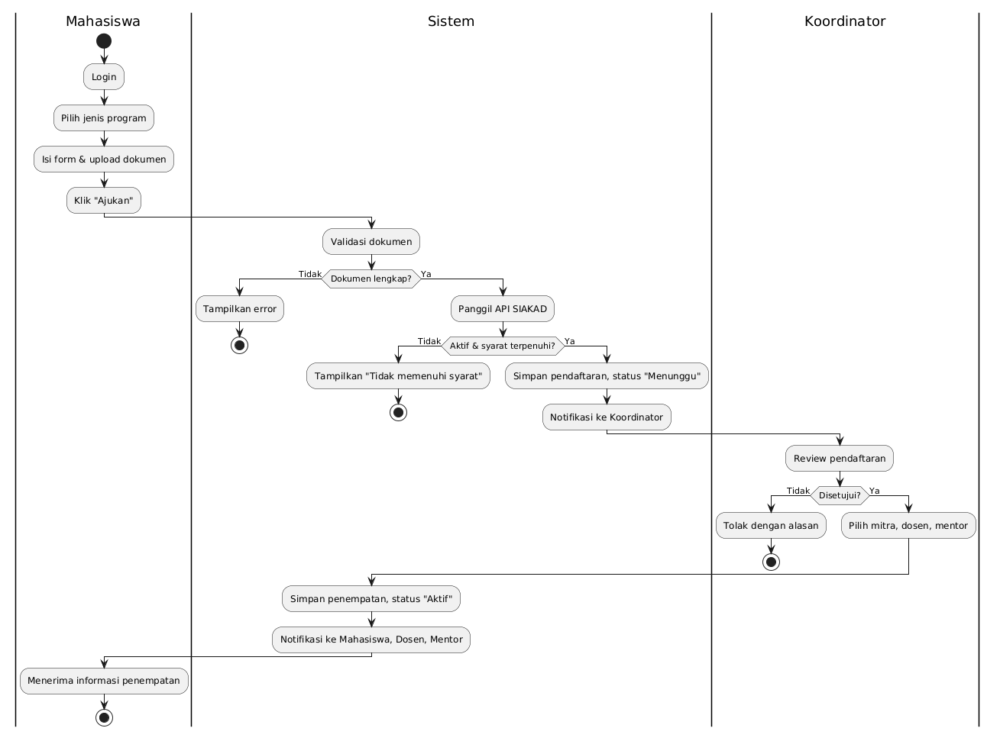
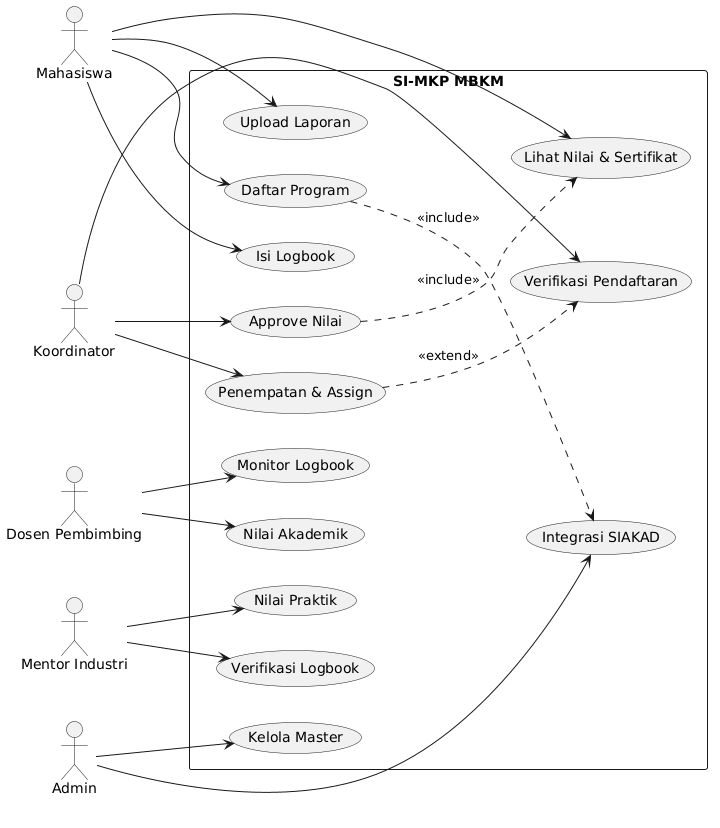
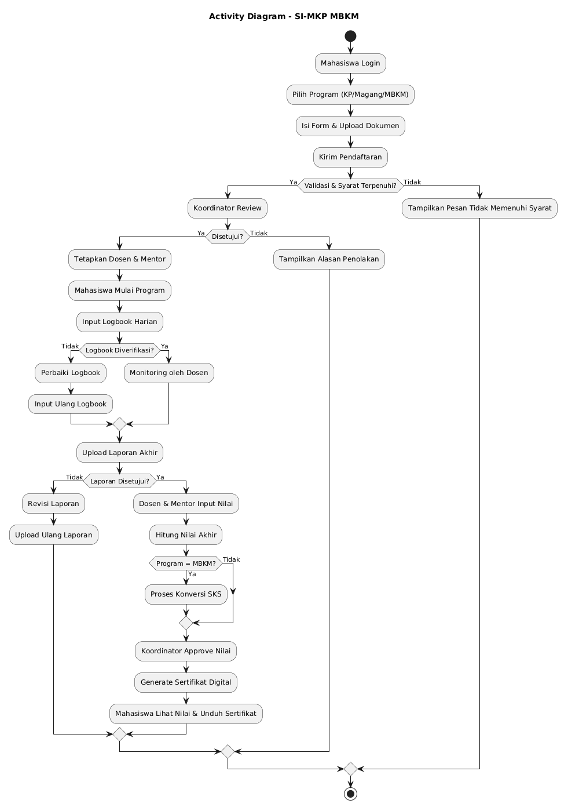
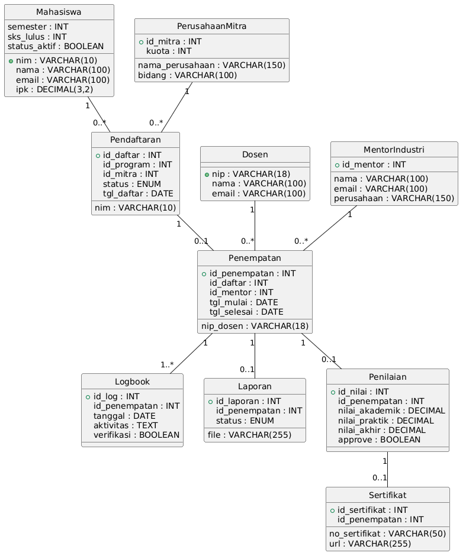
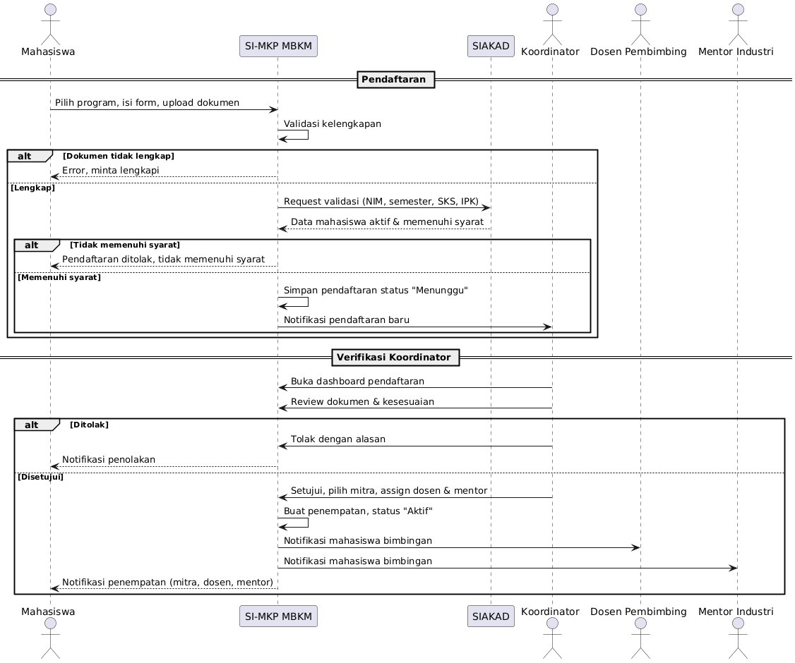
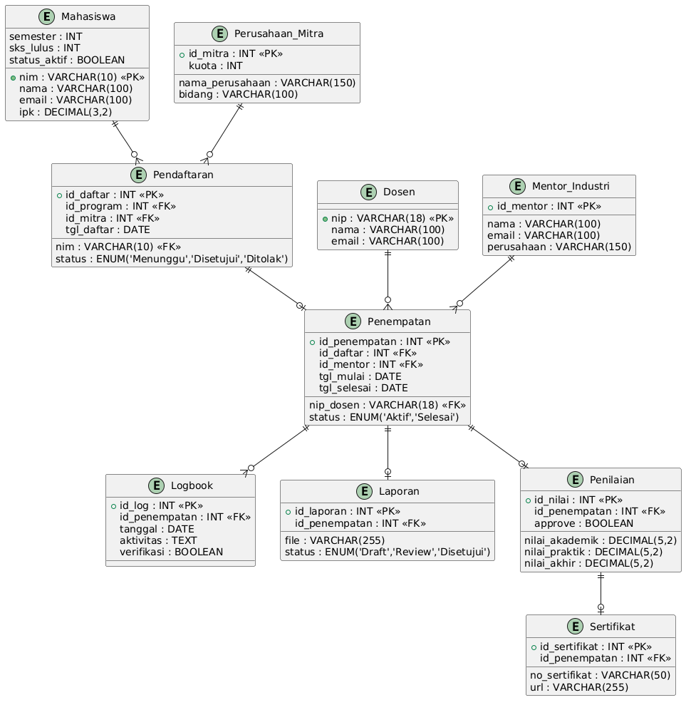

# Sistem Informasi Manajemen Magang, Kerja Praktik, dan MBKM (SI-MKP MBKM)
## Deskripsi Sistem

SI-MKP MBKM merupakan sistem informasi yang digunakan untuk mengelola proses Kerja Praktik (KP), Magang, dan Merdeka Belajar Kampus Merdeka (MBKM) secara terintegrasi mulai dari pendaftaran, monitoring kegiatan, penilaian, konversi SKS MBKM, hingga penerbitan sertifikat digital.
## Aktor Sistem

| Aktor | Deskripsi |
|--------|-----------|
| Mahasiswa | Mengikuti program KP, Magang, atau MBKM |
| Dosen Pembimbing | Monitoring dan penilaian |
| Mentor Industri | Verifikasi logbook dan penilaian |
| Koordinator Program | Verifikasi dan approval |
| Admin | Pengelolaan data sistem |

## BPMN

### Penjelasan

Diagram BPMN menggambarkan proses bisnis SI-MKP MBKM mulai dari proses pendaftaran mahasiswa, verifikasi dokumen, pelaksanaan program, monitoring kegiatan, penilaian, hingga penerbitan sertifikat.

## Use Case Diagram

### Penjelasan

Use Case Diagram menggambarkan hubungan antara aktor dan sistem serta menunjukkan fungsi utama yang dapat dijalankan oleh masing-masing aktor dalam SI-MKP MBKM.

## Activity Diagram

### Penjelasan

Activity Diagram menggambarkan alur proses SI-MKP MBKM mulai dari pendaftaran program, verifikasi, pelaksanaan kegiatan, monitoring logbook, penilaian, konversi SKS MBKM, hingga penerbitan sertifikat digital.

## Class Diagram

### Penjelasan

Class Diagram menunjukkan struktur data dan hubungan antar entitas yang digunakan dalam SI-MKP MBKM.

## Sequence Diagram

### Penjelasan

Sequence Diagram menggambarkan urutan interaksi antara aktor dan sistem selama proses bisnis berlangsung.

## Entity Relationship Diagram (ERD)

### Penjelasan

ERD menggambarkan struktur basis data serta hubungan antar entitas yang digunakan dalam SI-MKP MBKM.
